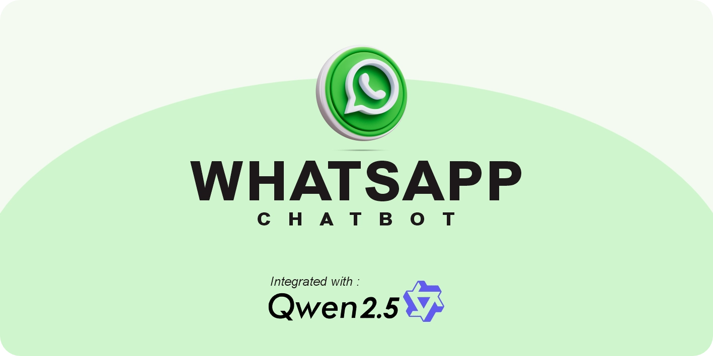

# Chatbot Whatsapp Integrated with AI



Project ini adalah chatbot untuk WhatsApp serbaguna yang bisa digunakan untuk Chatbot WA biasa ataupun diintegrasikan dengan LLM lokal.

## Teknologi yang digunakan

- Chatbot ini ditulis dengan menggunakan Typescript dan menggunakan Bun sebagai interpreternya

- Menggunakan Library Whatsapp-web.js dan qr-code terminal untuk aktivasi chatbot dan ollama untuk connect dengan local LLM.

- Untuk deployment local menggunakan pm2.

## Struktur Proyek

Proyek ini terdiri dari beberapa bagian utama:

- **src**: Folder yang berisi kode sumber utama project.
  - **index.ts**: File utama proyek, di mana aplikasi dimulai.
  - **config/**: Folder untuk konfigurasi aplikasi.
    - **settings.ts**: File untuk mengatur setting aplikasi.
  - **handlers/**: Folder untuk handler pesan.
    - **messageHandler.ts**: File untuk menangani pesan masuk.
    - **messageProcessor.ts**: File untuk memproses pesan.
  - **services/**: Folder untuk layanan tambahan.
    - **aiServices.ts**: File untuk konfigurasi AI seperti System Prompt.
  - **state/**: Folder untuk state aplikasi.
    - **store.ts**: File untuk menyimpan dan mengambil data state.
  - **types/**: Folder untuk tipe-tipe yang digunakan dalam project.
    - **index.ts**: File utama folder types.
  - **utils/**: Folder untuk utilitas umum.
    - **textUtils.ts**: File untuk utilitas teks.
    - **timeUtils.ts**: File untuk utilitas waktu.
    - **validators.ts**: File untuk validasi input yang diterima chatbot.

## Instalasi

Untuk menginstal semua dependensi yang diperlukan, jalankan perintah berikut di terminal:

```bash
bun install
```

## Menjalankan Aplikasi

Setelah semua dependensi terinstal, Anda dapat menjalankan aplikasi dengan perintah berikut:

```bash
bun run src/index.ts
```

Setelah dijalankan untuk pertama kali, di terminal akan muncul qr-code dan scan itu dengan WA anda untuk menyambungkan dengan chatbot.

Untuk deployment secara temporer bisa menggunakan pm2.

instal pm2 dengan perintah berikut :

```bash
npm install -g pm2-windows-startup
```

Setelah terinstal buka project anda sebelumnya dan ketikkan perintah berikut untuk jalankan kode di pm2.

```bash
pm2 start src/index.ts --interpreter bun --name "bot-wa" --watch
```

Kita pakai --watch supaya ketika kita edit kode kita bisa langsung jalan tanpa perlu restart pm2.

Aplikasi ini akan berjalan dan merespon pesan masuk di WhatsApp.

Dokumentasi ini dibuat untuk memberikan gambaran umum tentang proyek chatbot-wa. Untuk informasi lebih lanjut tentang penggunaan dan pengembangan, silakan merujuk pada kode sumber dan komentar yang ada dalam proyek.
